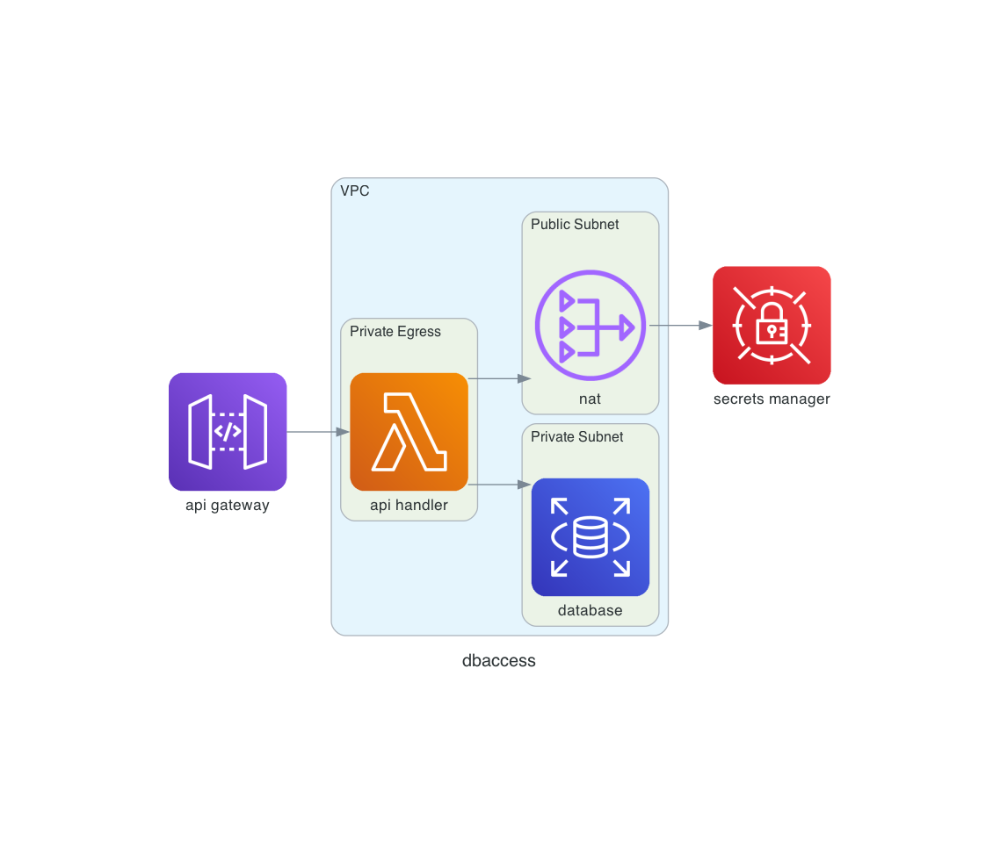

# AWSDiagrams
Cloud Diagrams with python diagrams library 

## How to start

### Install graphviz

```bash
	brew install graphviz  
```

### Setup python

```bash
	pipenv shell
	pipenv install
```

## Generate the diagrams

```bash
	python FILENAME.py
```

## Example

Api interacting with database, file: dbaccess.py

